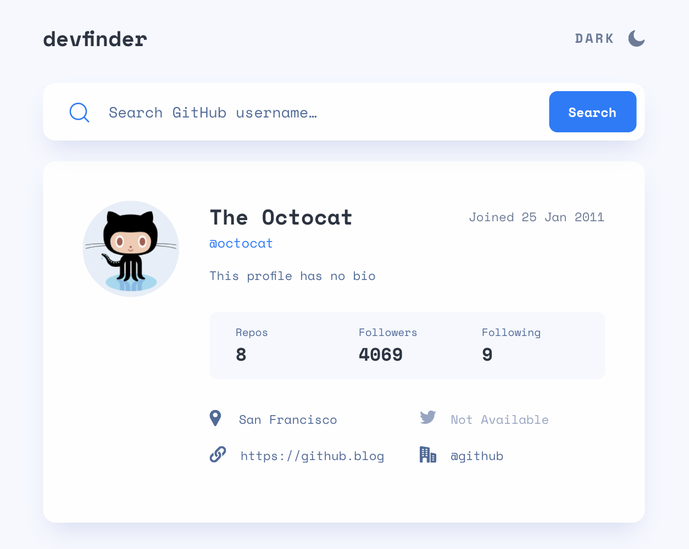
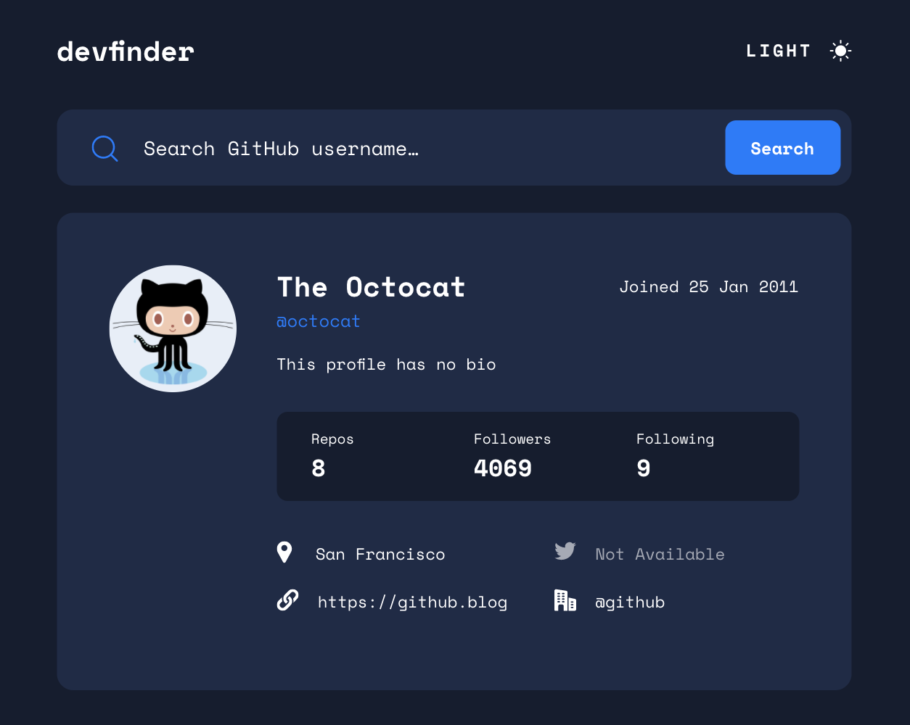

# Dev Finder
## GitHub pages 

https://yuliaiv-iv.github.io/devfinder/

[Frontend Mentor](https://www.frontendmentor.io) challenges help you improve your coding skills by building realistic projects. 
### Overview
Users should be able to:

- Switch between light and dark themes
- View the optimal layout for the app depending on their device's screen size
- See hover states for all interactive elements on the page
- Search for GitHub users by their username
- See relevant user information based on their search
### Built with

- Semantic HTML5 markup
- CSS3
- Flexbox
- CSS Grid
- [React](https://reactjs.org/) - JS library

### Installation and launching
* `npm install` installation of dependencies into package.json
* `npm start` starts the project

  
  

